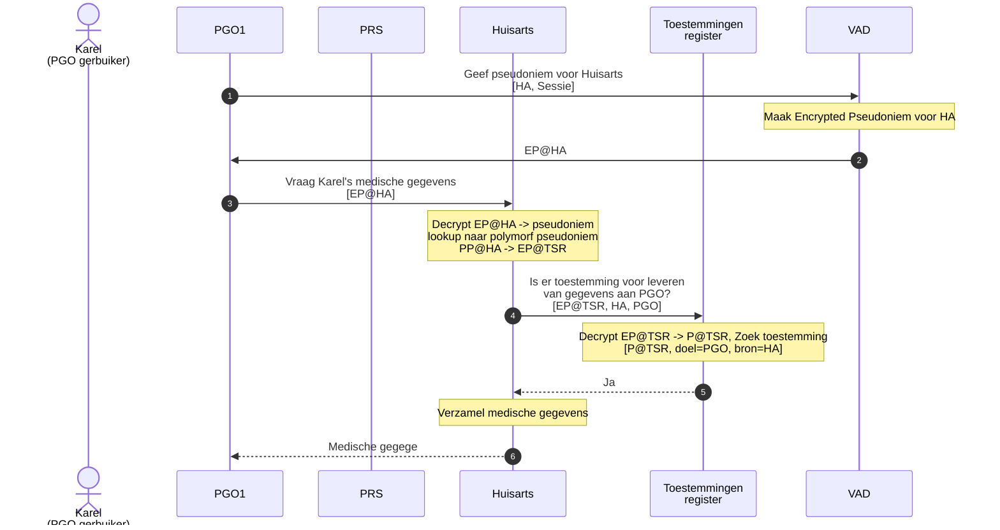
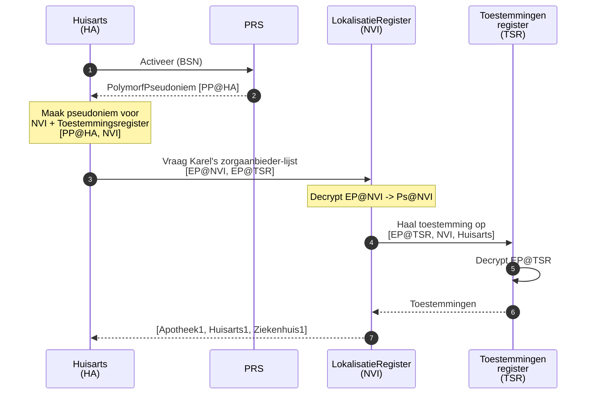

# Sequentie diagrammen

## PGO vraagt op bij Zorgaanbieder

```mermaid
sequenceDiagram
    actor burger as Karel<br>(PGO gerbuiker)
    participant PGO1
    participant PRS
    participant HA as Huisarts
    participant TSR as Toestemmingen<br> register

    autonumber

    PGO1 ->> VAD: Geef pseudoniem voor Huisarts<br> [HA, Sessie]
    note over VAD: Maak Encrypted Pseudoniem voor HA
    VAD ->> PGO1: EP@HA

    PGO1 ->> HA: Vraag Karel's medische gegevens<br> [EP@HA]
    note over HA: Decrypt EP@HA -> pseudoniem<br> lookup naar polymorf pseudoniem<br> PP@HA -> EP@TSR
    HA ->> TSR: Is er toestemming voor leveren<br> van gegevens aan PGO?<br> [EP@TSR, HA, PGO]
    note over TSR: Decrypt EP@TSR -> P@TSR, Zoek toestemming<br> [P@TSR, doel=PGO, bron=HA]
    TSR -->> HA: Ja
    note over HA: Verzamel medische gegevens
    HA -->> PGO1: Medische gegege
```

## Zorgaanbieder lokaliseert gegevens

```mermaid
sequenceDiagram
    participant HA as Huisarts<br/> (HA)
    participant PRS as PRS
    participant NVI as LokalisatieRegister<br> (NVI)
    participant TSR as Toestemmingen<br/>register<br/>(TSR)

    autonumber

    HA ->> PRS: Activeer (BSN)
    PRS -->> HA: PolymorfPseudoniem [PP@HA]


    note over HA: Maak pseudoniem voor <br/>NVI + Toestemmingsregister<br/>[PP@HA, NVI]
    HA ->> NVI: Vraag Karel's zorgaanbieder-lijst<br/> [EP@NVI, EP@TSR]
    note over NVI: Decrypt EP@NVI -> Ps@NVI
    NVI ->> TSR: Haal toestemming op<br> [EP@TSR, NVI, Huisarts]
    TSR ->> TSR: Decrypt EP@TSR
    TSR -->> NVI: Toestemmingen
    NVI -->> HA: [Apotheek1, Huisarts1, Ziekenhuis1]
```
