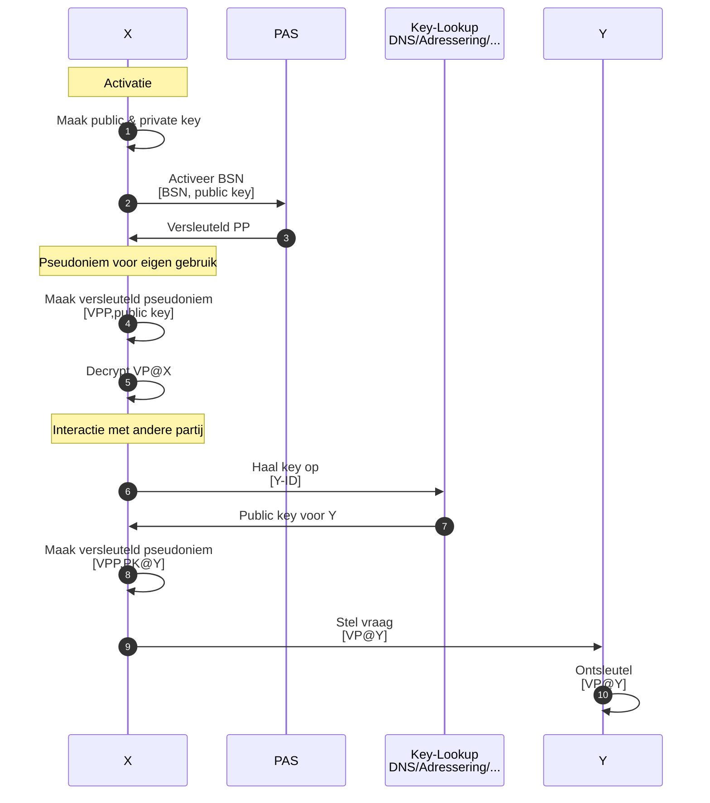
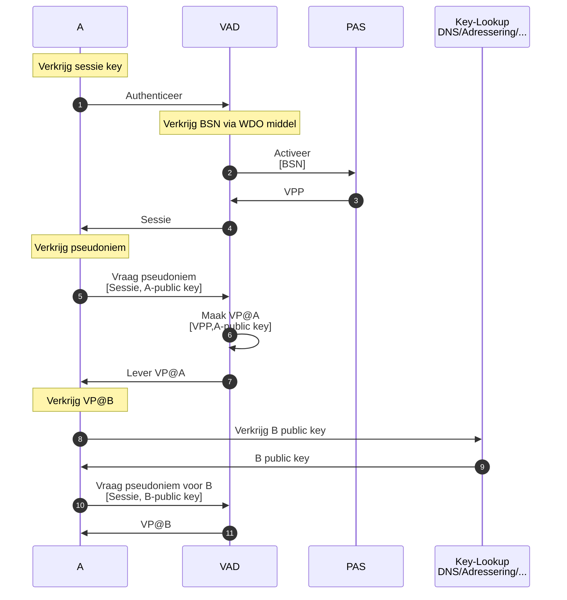
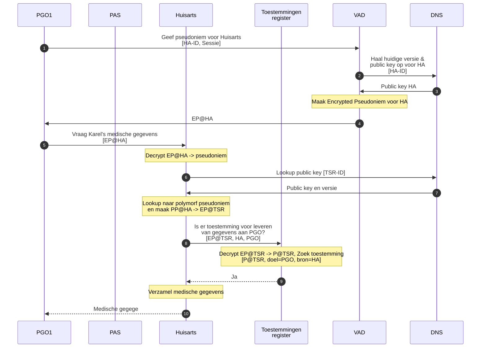
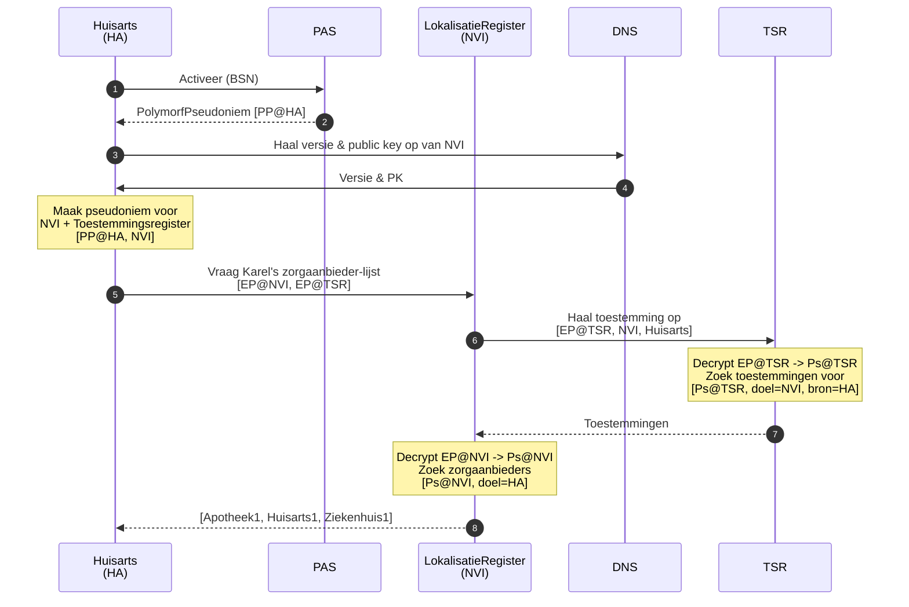
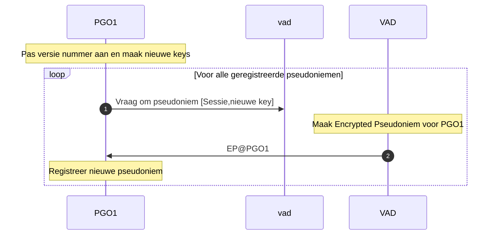
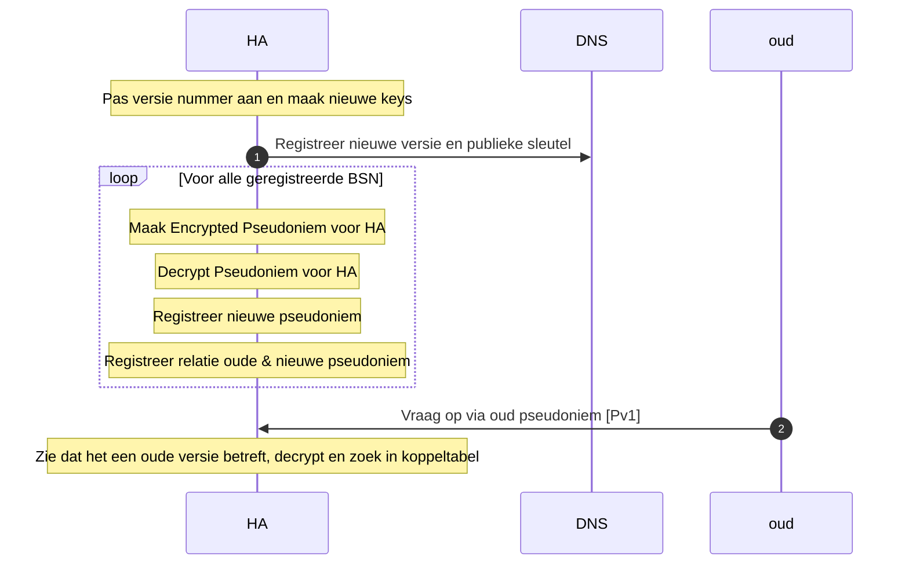
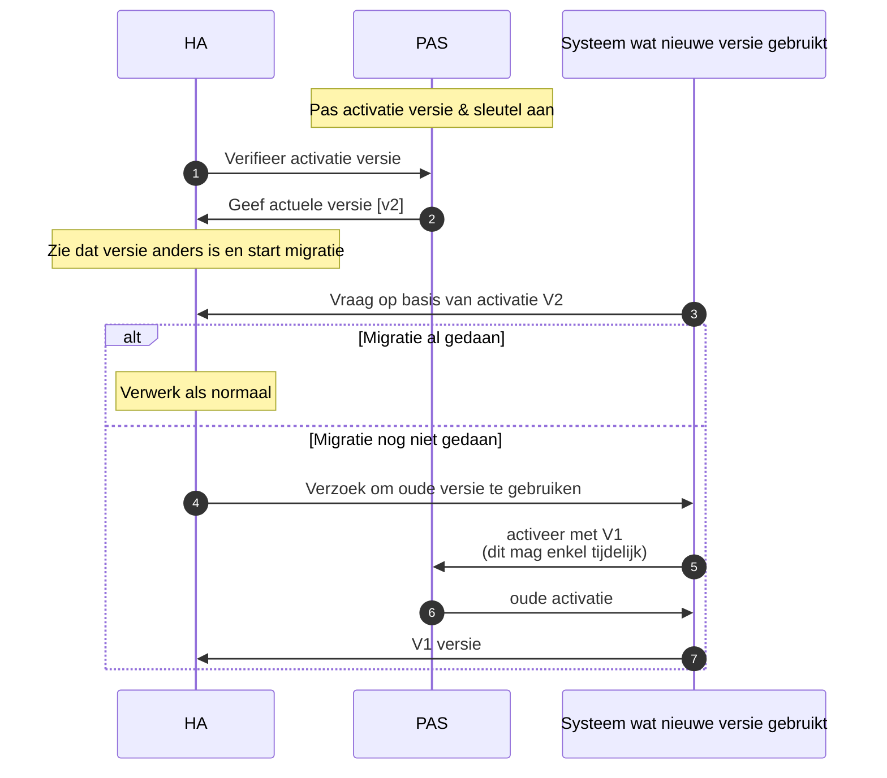
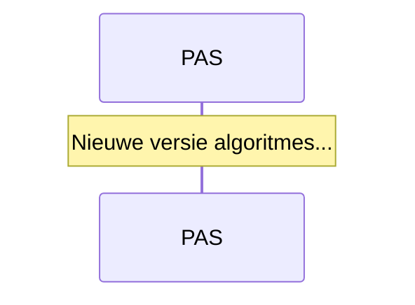

# Sequentie diagrammen

Algemene patroon BSN partij

Algemeen niet BSN gerechtigd

## Burger log in bij PGO

## PGO vraagt op bij Zorgaanbieder

## Zorgaanbieder lokaliseert gegevens

## Registratie voor lokalisatie

### Migratie 

Migratie van pseudoniemen van één partij

Partij met PP

Migratie van alle pseudoniemen

Crypto rollover

